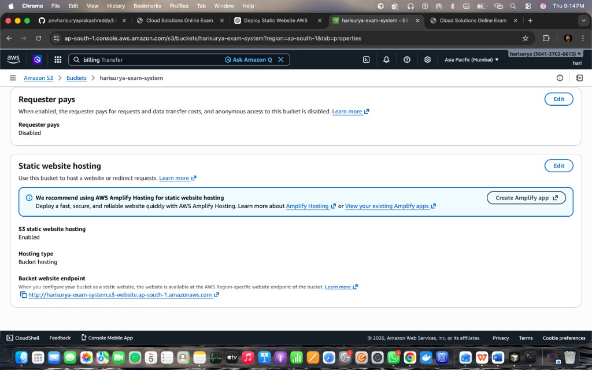

# 🚀 Exam Interface Management System (EIMS)


The **Exam Interface Management System (EIMS)** is a cloud-enabled web application that allows users to take online exams, automatically calculate their score, and display real-time feedback.

This project demonstrates **cloud deployment using AWS S3 static website hosting** along with a modern **HTML, CSS, and JavaScript frontend**.

---

# 📌 Live Demo

```
AWS Deployment URL
```

Example:

```
http://your-bucket-name.s3-website-ap-south-1.amazonaws.com
```

---

# 📷 Project Preview



---

# 🧠 Project Overview

The **Exam Interface Management System** provides an interactive interface where users can attempt multiple-choice questions and instantly receive their results.

### Key Features

✔ Modern exam interface  
✔ Timer-based exam submission  
✔ Automatic score calculation  
✔ Correct and incorrect answer highlighting  
✔ Animated result display  
✔ Best score tracking using localStorage  
✔ Cloud deployment using AWS  

---

# 🛠 Tech Stack

## Frontend
- HTML5
- CSS3
- JavaScript (Vanilla)

## Cloud Platform
- Amazon Web Services (AWS)

Services Used:

| AWS Service | Purpose |
|-------------|--------|
| **Amazon S3** | Static website hosting |
| **IAM** | Access control |
| **CloudFront** *(optional)* | CDN for faster delivery |
| **CloudWatch** *(optional)* | Monitoring |

---

# 📁 Project Structure

```
Exam-Interface-Management-System
│
├── index.html
├── style.css
├── script.js
├── assets
│   ├── aws-static-hosting.png
│   └── aws-bucket-objects.png
└── README.md
```

---

# 🧩 Core Components

## index.html

Main entry point of the application.

Contains:

• Exam interface  
• Multiple choice questions  
• Countdown timer  
• Submit button  
• Result display section  

---

## style.css

Responsible for the **visual design** of the website.

Features:

• Gradient background  
• Glassmorphism UI  
• Hover animations  
• Highlighting for correct/wrong answers  
• Responsive layout  

---

## script.js

Handles the **core application logic**.

Features implemented:

### Timer System
- Starts automatically on page load
- Countdown from **60 seconds**
- Auto submission when time expires

### Answer Validation
- Compares selected answers with correct answers
- Marks correct and incorrect responses

### Score Calculation

Example:

```
Score = Correct Answers / Total Questions
```

Displayed as:

```
You scored 4/5!
```

### Score Persistence

Using **localStorage**

Stored values:

```
examLastScore
examBestScore
```

Allows tracking the user's best score.

---

# ☁ AWS Deployment Architecture

The project is deployed using **AWS S3 Static Website Hosting**.

## Architecture Diagram

```
User Browser
      ↓
Internet
      ↓
AWS S3 Static Website Bucket
      ↓
index.html
style.css
script.js
      ↓
JavaScript runs exam logic
```

---

# 🚀 Deployment Steps

## Step 1 — Create S3 Bucket

Open AWS Console → S3 → Create Bucket

Example bucket name:

```
harisurya-exam-system
```

Region:

```
Asia Pacific (Mumbai)
```

---

## Step 2 — Upload Project Files

Upload:

```
index.html
style.css
script.js
```

---

## Step 3 — Enable Static Website Hosting

Go to:

```
Bucket → Properties → Static Website Hosting
```

Enable and set:

```
Index document: index.html
```

---

## Step 4 — Configure Public Access

Add bucket policy:

```
Effect: Allow
Principal: *
Action: s3:GetObject
Resource: arn:aws:s3:::your-bucket-name/*
```

---

## Step 5 — Access Website

AWS generates a URL like:

```
http://your-bucket-name.s3-website-ap-south-1.amazonaws.com
```

Open it to access the application.

---

# 🔄 Application Workflow

```
User opens website
        ↓
AWS S3 serves index.html
        ↓
Browser loads CSS and JS
        ↓
Exam interface appears
        ↓
User answers questions
        ↓
User submits exam or timer expires
        ↓
JavaScript calculates score
        ↓
Result displayed instantly
```

---

# 🌟 Advantages of AWS S3 Hosting

✔ Highly scalable  
✔ Low cost (Free Tier eligible)  
✔ No server maintenance  
✔ High availability  
✔ Easy deployment  

---

# 🔮 Future Enhancements

Possible improvements:

• Add backend using **AWS Lambda**  
• Store exam results in **AWS RDS**  
• Add **user authentication** using AWS Cognito  
• Use **CloudFront CDN** for faster delivery  
• Admin dashboard for creating exams  

---

# 👨‍💻 Author

**Harisurya Prakash Reddy**

B.Tech Computer Science Engineering  
Cloud & Data Engineering Enthusiast  

GitHub:  
https://github.com/pnvharisuryaprakashreddy

LeetCode:  
https://leetcode.com/u/harisurya-reddy/

---

⭐ If you like this project, consider giving it a **star** on GitHub!
